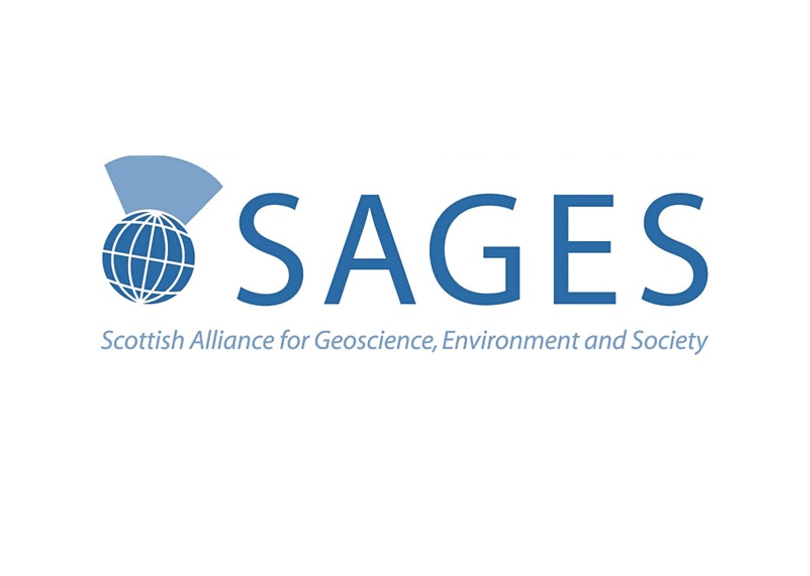
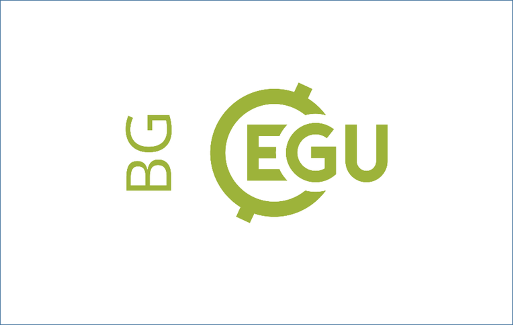
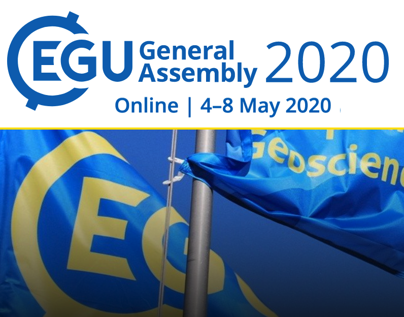

<!-- Main -->

<!-- One -->
<section id="one">
	

		<header class="major">
			<h2>Latest news</h2>
		</header>
		
Here you can read about my latest news. I typically like to write about new papers I've published, conferences, grants, or anything else exciting that has happened. Take a look, you might find something interesting!

	

</section>

<!-- Two -->
<section id="two" class="spotlights">
	<section>
		
		

			

				<header class="major">
					<h3>New grant funded!</h3>
				</header>
				
I am pleased to have been awarded a £2000 grant by SAGES (Scottish Alliance for Geoscience, Environment and Scoiety) through the COVID-19 postrgaudate support scheme.I'll be using this money to conduct some phytoplankton sampling in Scotland as a first step towards setting up the isotpoe tracer method I am planning to deploy in Antarctica.

				<ul class="actions">
					<li><a href="newgrant.html" class="button">Read more</a></li>
				</ul>
			

		

	</section>
	<section>
		
		

			

				<header class="major">
					<h3>New preprint available</h3>
				</header>
				
A new preprint from my masters work is now available for reading while it undergoes an open review process at the EGU's Biogeosciences journal. The new paper, <a href="https://bg.copernicus.org/preprints/bg-2020-399">Uncovering the influence of methodological variations on the extractability of iron bound organic carbon"</a> is in the form of a technical note and reports on experiments done during my time at the University of Leeds evaluating iterations of the CBD protcol for extracting iron bound organic carbon.

				<ul class="actions">
					<li><a href="bg.html" class="button">Read more</a></li>
				</ul>
			

		

	</section>
	<section>
		
		

			

				<header class="major">
					<h3>EGU 2020</h3>
				</header>
				
 I presented my first international conference talk virtually at EGU2020 in the BG4.2 session. My talk "What's af(Fe)cting OC-Fe interactions? An experimental approach to understanding iron bound organic carbon in sediments" focused on the work done during my masters to determine the extent of the role of reactive iron in stabilising organic carbon. The abstract for this talk is available via the link below.

				<ul class="actions">
					<li><a href="EGU20.html" class="button">See abstract</a></li>
				</ul>
			

		

	</section>
</section>

<!-- Three -->
<section id="three">
	

		<header class="major">
			<h2>Massa libero</h2>
		</header>
		
Nullam et orci eu lorem consequat tincidunt vivamus et sagittis libero. Mauris aliquet magna magna sed nunc rhoncus pharetra. Pellentesque condimentum sem. In efficitur ligula tate urna. Maecenas laoreet massa vel lacinia pellentesque lorem ipsum dolor. Nullam et orci eu lorem consequat tincidunt. Vivamus et sagittis libero. Mauris aliquet magna magna sed nunc rhoncus amet pharetra et feugiat tempus.

		<ul class="actions">
			<li><a href="generic.html" class="button next">Get Started</a></li>
		</ul>
	

</section>

