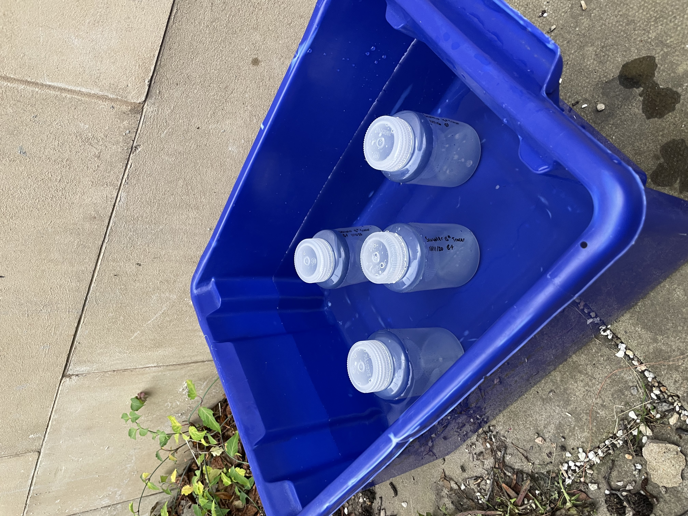
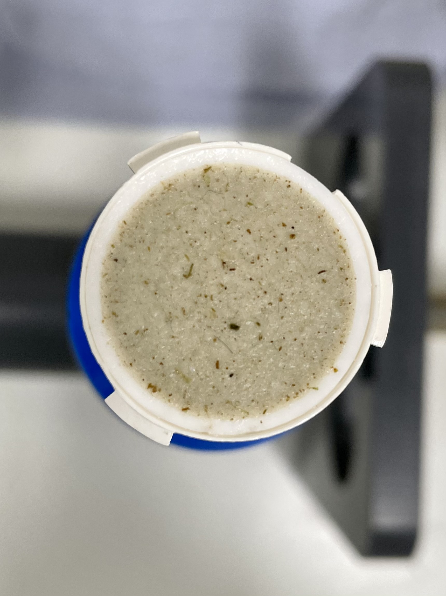

I am pleased to have been awarded a £2000 grant by SAGES (Scottish Alliance for Geoscience, Environment and Scoiety) through the COVID-19 postrgaudate support scheme. I'll be using this money to conduct some phytoplankton sampling in Scotland as a first step towards setting up the isotpoe tracer method I am planning to deploy in Antarctica.

I, like all PhD students, have been massivley affected by the COVID-19 pandemic. The first year of my PhD was supposed to  be spent on fieldwork in Antarctica, but travel restrictions and the need to maintian Antarctica as the only COVID free contienent on Earth brought these plans to a screeching halt in early summer. Since then, working with my supervisors, a plan B had to be put in place. Suprisingly, rearranging the fieldwork is the easy part of the problem. The bigger question was how to fill a year prior to fieldwork with no samples and no data, and how could I avoid being rushed for time when I (finally) return. 

In the end, we decided the best use of time was to bring forward the method development stage of my PhD, which I had planned to use my fieldwork samples for. Specifically this is about developing the 15N and 13C isotope tracer method from colleauges at SAMS to be used on the Edinburgh isotope ratio mass spectrometer (IRMS). This meant I could answer some key quesitons such as, how much sample to filter and what calibration range to setup prior to sampling, saving much needed time when I return from the delayed field season. Funding this was the next challenge, isotope tracer reagents are very expensive and equipment as well as insturment time were not part of my inital PhD plan. With UKRI deciding not to fund extensions or additional research costs, I applied to SAGES via their PoGSS (Postgraduate support scheme), a fund specifically setup to help COVID affeceted PhD students. Since been awarded this money I have hit the ground running with 2 sampling trips already completed, the local nutrient profile determined and the first set of uptake experiments and filtrations conducted. 

I am incredibly grateful for the support SAGES has offered me, it has been a massive help to mitigating the distrubance to my PhD. For now I am going to continue running these experiments and make as much methods progress as posisble while I keep my fingers crossed for a 2021/22 field season! 

Incubation of phytoplankton sampled from Dunbar, Scotland <i>left</i> Particulate organic matter filtered out of seawater samples <i>right</i>
